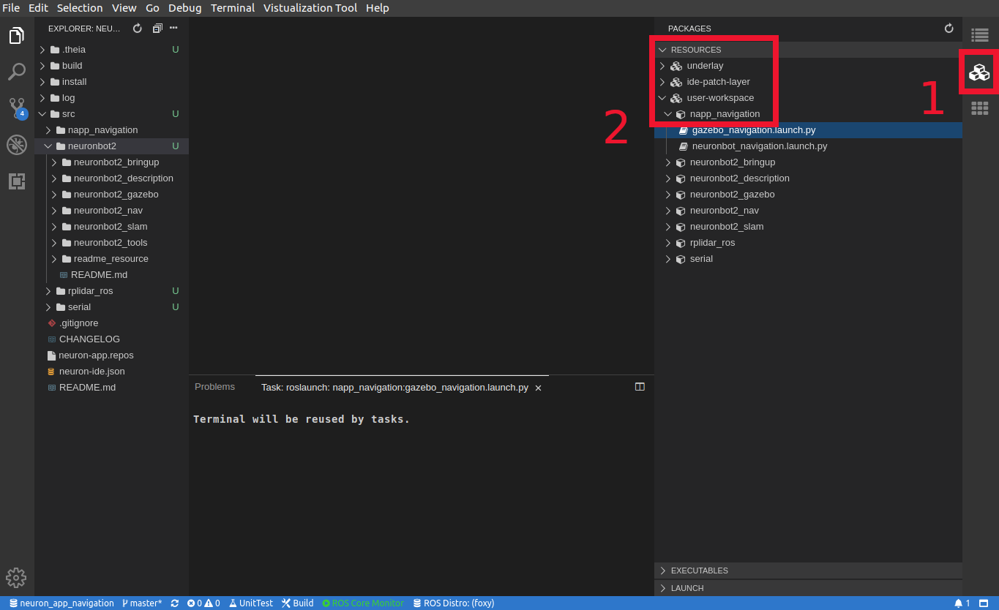
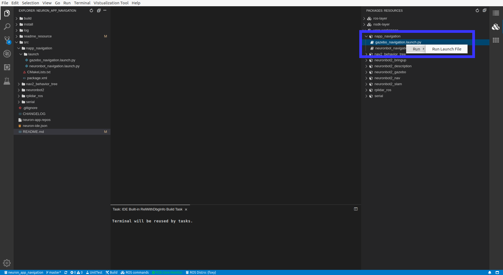
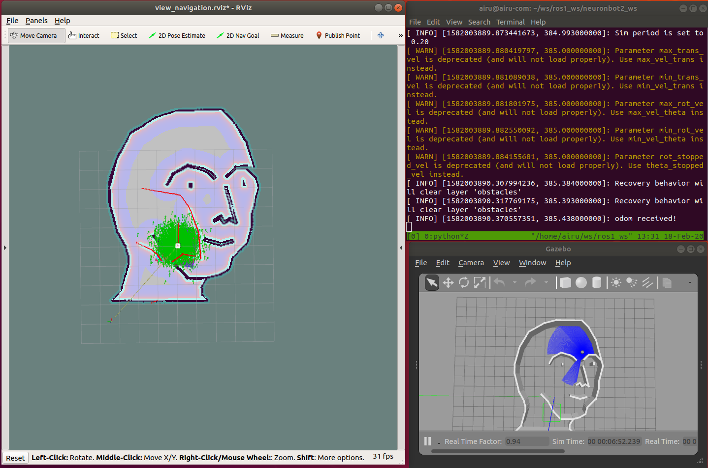
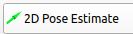
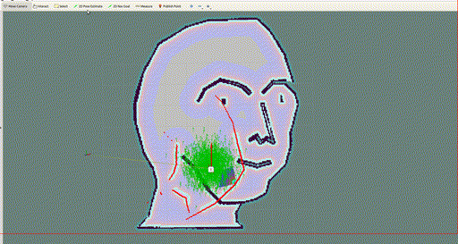
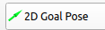

# Neuron APP: Navigation

# Support Platform:

* ADLINK Controller:
  - ROScube-I
  - ROScube-X
  - ROScube starterkit
* ROS version:
  - ROS 2 foxy

# Usage

## Quickstart

Once users obtain the map, pgm file, and yaml file, navigation is good to go.
1. Click application in Neuron App to open workspace. **Click Navigation.**  It will build the resource at first time it's opened.
     
   
2-1. Click "packages" on the right side.

2-2. Open list by click "RESOURCES" -> "user-workspace" -> "napp_navigation"
     
     

***NOTE!!! Following instruction would need : Right click desired launch file and click "Run" -> "Run Launch File" as image bellow***

   
   
3. Launch Navigation as well as Rviz, choose **ONE**  file to launch: 
    * Simulation with the Gazebo. It will open with default mememan map: **Launch gazebo_inspection.launch.py**
    
    **NOTE : Before you deploy navigation on Neuronbot2, you shall first complete [SLAM](https://github.com/H-HChen/neuron_app_slam)**
    
    * Deploy on Neuronbot2. It will open with default map, which is automatically saved in directory of neuron_app_slam: **Launch neuronbot_inspection.launch.py**
    
   
4. Set Estimation

   

   Click "2D Pose Estimate", and set estimation to the approximate location of robot on the map.
   

   
5. Set Goal

   

   Click "2D Nav Goal", and set goal to any free space on the map.
  
   
   

## Navigation on custom map

1. Click "Explorer" on the left side.

2. Open launch file, choose **ONE**, depend on your task.
    * For simulation: Click "src" -> "napp_navigation" -> "launch" -> "gazebo_navigation.launch.py"
    
    * For Neuronbot2: Click "src" -> "napp_navigation" -> "launch" -> "neuronbot_navigation.launch.py"

3. Modify file directory of map at default value in map_path.

   

4. Follow Step3 to Step5 in **Quickstart**.

# Troubleshooting

If you face some problems while launching NeuronBot simulation, try to terminate the task and retry again.
There might be some processes still running and cause the issue.