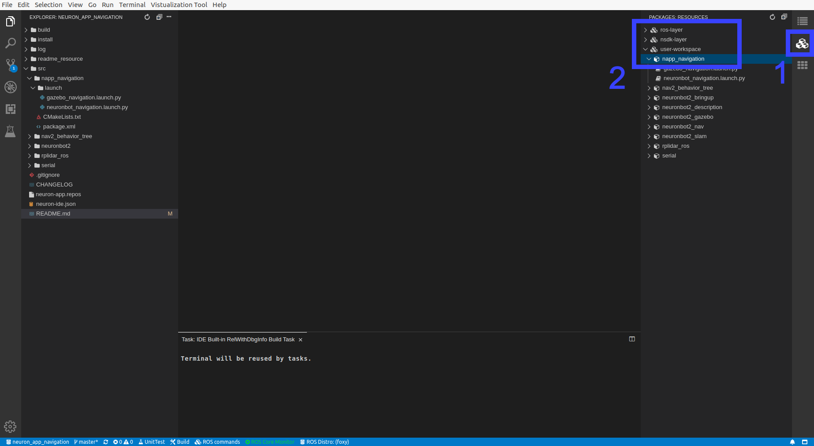

# Neuron APP: Navigation

# Support Platform:

* ADLINK Controller:
  - ROScube-I
  - ROScube-X
  - ROScube starterkit
* ROS version:
  - ROS 2 foxy

# Usage
Once users obtain the map, pgm file, and yaml file, navigation is good to go.
1. Click application in Neuron App to open workspace. It will build the resource at first time it's opened.
     
   
2-1. Click "packages" on the right side.

2-2. Open list by click "RESOURCES" -> "user-workspace" -> "napp_slam"
     
     

***NOTE!!! Following instruction would need : Right click desired launch file and click "Run" -> "Run Launch File" as image bellow***

   
3. Launch Navigation as well as Rviz with the Gazebo simulation. Launch gazebo_navigation.launch.py

If you haven't finished SLAM to get the map files, no worries, you can use the default maps **mememan** we have built for you.

   
4. Set Estimation

   

   Click "2D Pose Estimate", and set estimation to the approximate location of robot on the map.
   

   
5. Set Goal

   

   Click "2D Nav Goal", and set goal to any free space on the map.
  
   
   

