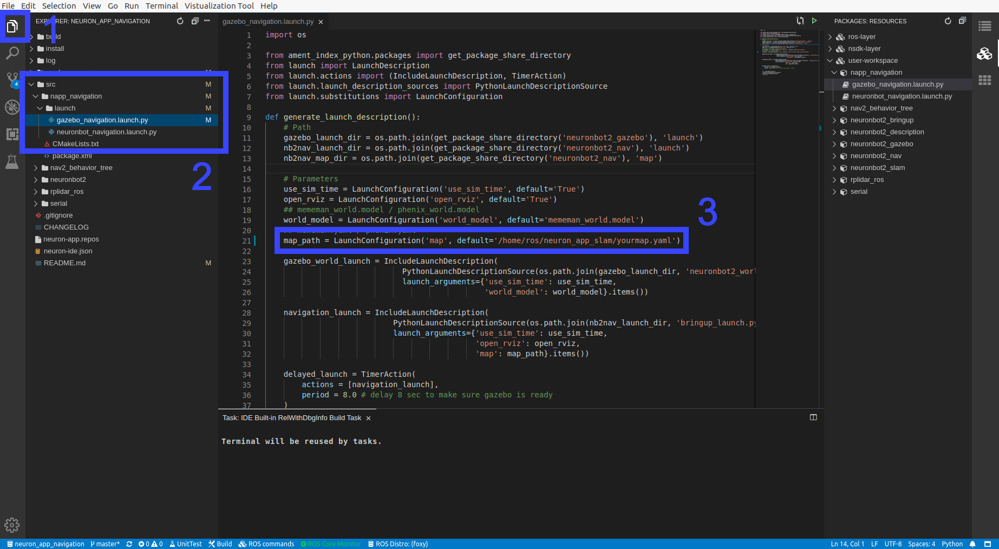

# Neuron APP: Navigation

# Support Platform:

* ADLINK Controller:
  - ROScube-I
  - ROScube-X
  - ROScube starterkit
* ROS version:
  - ROS 2 foxy

# Usage

## Quickstart

**Please enter workspace of Navigation in Neuron IDE before you start Neuron App.**

Once users obtain the map, pgm file, and yaml file, navigation is good to go.

***Note! If pictures is too small for your equipment. please click [Here](https://github.com/Adlink-ROS/neuron_app_navigation/blob/master/README.md) to open github page.***

1. Open "Packages:Resources" on the right side.

2. Open list by clicking "user-workspace" -> "napp_navigation"
   

***NOTE!!! Following instruction would need : Right click desired launch file and click "Run" -> "Run Launch File" as image bellow***

   

3. Launch Navigation as well as Rviz, choose **ONE**  file to launch:
    * Simulation with the Gazebo. It will open with default mememan map: **Launch gazebo_navigation.launch.py in napp_navigation**

    **NOTE : Before you deploy navigation on Neuronbot2, you shall first complete [SLAM](https://github.com/Adlink-ROS/neuron_app_slam)**

    * Deploy on Neuronbot2. It will open with default map, which is automatically saved in directory of neuron_app_slam: **Launch neuronbot_navigation.launch.py in napp_navigation**

   
4. Set estimation of robot position

   

   Click "2D Pose Estimate" in Rivz2, and set estimation to the approximate location of robot on the map.

   
5. Set Goal

   

   Click "2D Goal Pose" in Rivz2, and set goal to any free space on the map.
  

   

## Navigation on custom map

1. Open "Explorer" on the left side of Neueon IDE.

2. Open launch file, choose **ONE**, depend on your task.
    * For simulation: Click "src" -> "napp_navigation" -> "launch" -> "gazebo_navigation.launch.py"

    * For Neuronbot2: Click "src" -> "napp_navigation" -> "launch" -> "neuronbot_navigation.launch.py"

3. Modify default value in map_path to file directory of desired map with absolute path format.

   

4. Follow Step3 to Step5 in **[Quickstart](#Quickstart)**.

# Troubleshooting

If you face some problems while launching NeuronBot simulation, try to terminate the task and retry again.
There might be some processes still running and cause the issue.